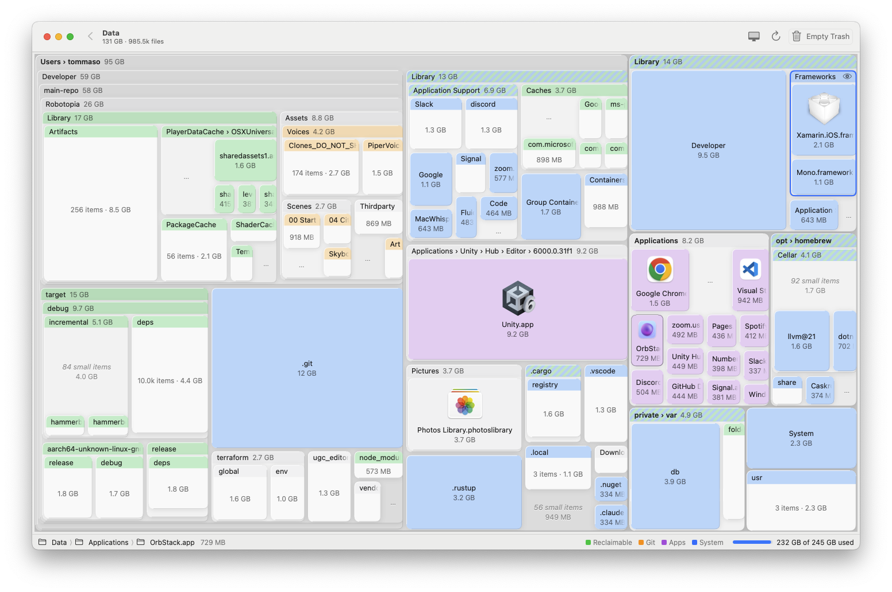
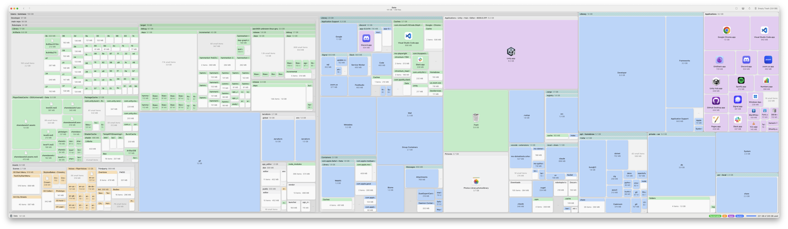
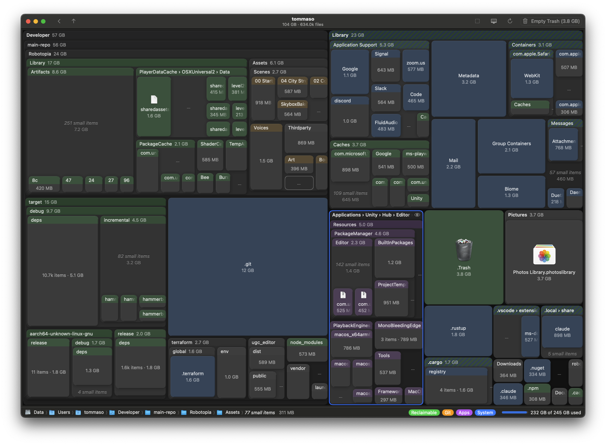
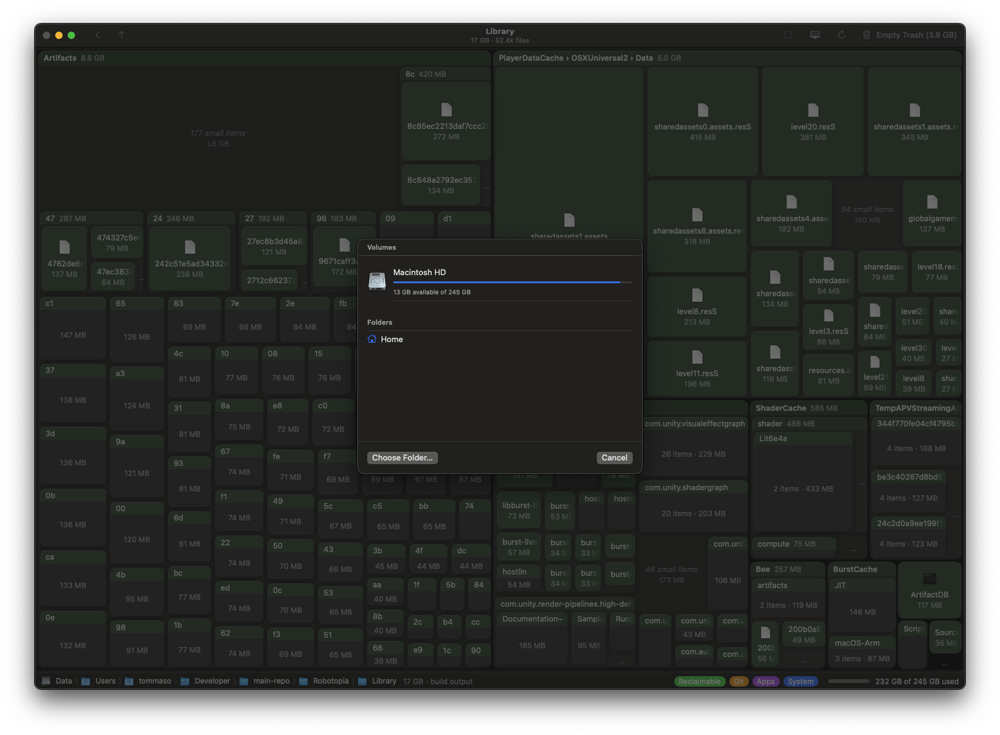
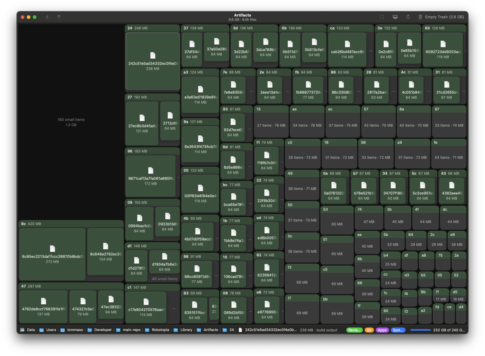
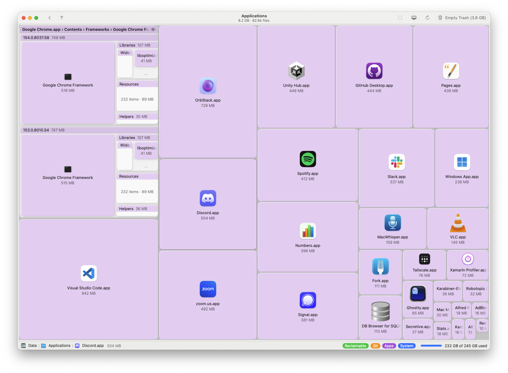

# MacTree

Claude-authored modern disk tree view for MacOS

# Why?

I didn't like the others! This one tries to blend in better with MacOS' design.

# Features

- Very fast
- Light & Dark Mode
- Supports Mac concepts like Bundle directories, apps, etc
- Recommends deletable files (but don't trust me on it)
- File icons
- Doesn't look terrible
- CLI Mode. Use `mactree <your path>` to open Mactree from your terminal

# Screenshots

Full Disk View



In its Ultrawide glory (tree depth adapts to your screen)



Dark mode



File Picker



Yay small build files



Find big apps easily



# Install

Needs macOS 15 or later. Open `MacTree.dmg` and drag MacTree into Applications.

MacTree › Install Command Line Tool… adds `mactree [folder]`, which opens MacTree there.

Scanning `~/Library` or the Trash hits macOS privacy folders; give MacTree Full Disk Access to
see inside them.

# Build

```sh
./scripts/bundle.sh --install     # release build → ~/Applications/MacTree.app
swift test                        # scanner, layout, classification
swift run MacTree --snapshot /tmp/shot ~/Developer   # renders shot-light/-dark.png, no window
MACTREE_SIGNING_SECRET=… ./scripts/release.sh        # signed, notarized build/MacTree.dmg
```

Needs only the Command Line Tools (Swift 6). `release.sh` lists the fields its secret holds.

A SwiftUI port of [tobi/disktree](https://github.com/tobi/disktree) (MIT).
